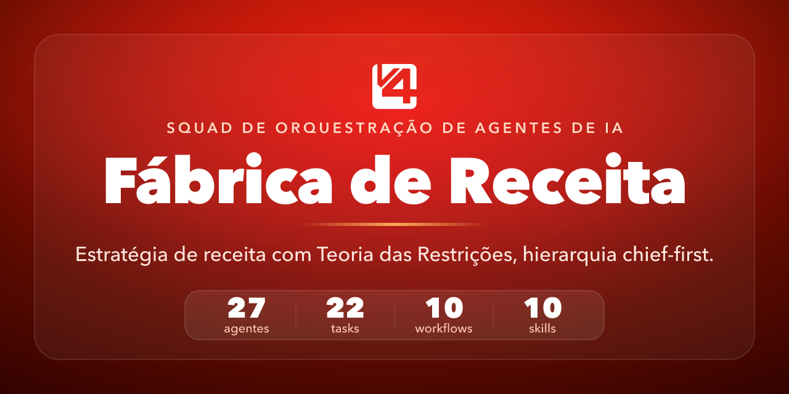
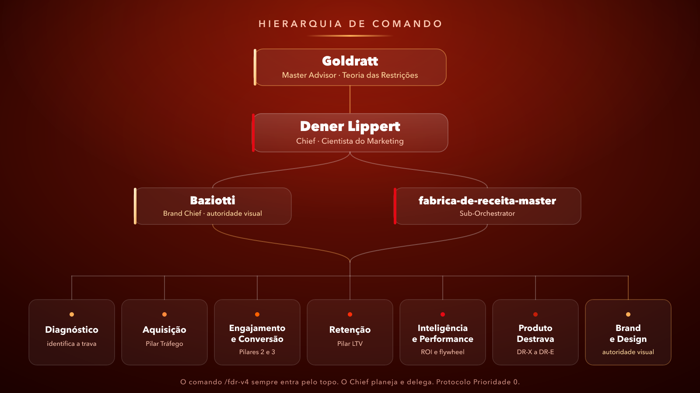
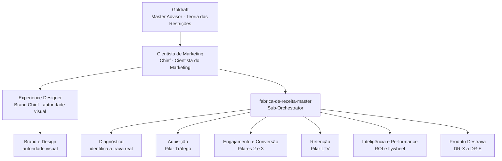

# Squad Fábrica de Receita



> Squad de estratégia de receita para o Claude Code. 27 personas em hierarquia de comando chief-first, Teoria das Restrições aplicada a receita, metodologia Fábrica de Receita e produtos Destrava Receita.


[](https://instagram.com/luizhenriquexpro)

Criado e mantido por **Luiz Henrique** ([@luizhenriquexpro](https://instagram.com/luizhenriquexpro)).

---

## Visão geral

O **Squad Fábrica de Receita** é um squad de estratégia de receita com 27 personas para o Claude Code. Ele empacota um método completo para encontrar e remover a única restrição que limita a receita de um negócio, e então executar contra ela em ciclos focados de 90 dias. A espinha teórica é a Teoria das Restrições (todo sistema tem um único elo mais fraco, e otimizar qualquer coisa que não seja esse elo é desperdício), combinada com a metodologia Fábrica de Receita da operação e suas 8 travas de receita.

O que o torna interessante é o modelo de orquestração. O squad opera uma hierarquia de comando em 3 camadas: um Master Advisor (a persona Goldratt, que aplica a Teoria das Restrições), um Chief (a persona Cientista de Marketing, o cientista do marketing que dá a palavra final) e um Sub-Orchestrator que roteia o trabalho aos especialistas dos 7 fluxos estratégicos. A invocação é chief-first por design: o comando sempre carrega o Chief, o Chief sempre monta um plano de ação e delega, e nenhum comando executa uma task diretamente. Esse é o protocolo Prioridade 0, inegociável.

A qualidade é garantida de forma estrutural. Quatro Quality Gates canônicos protegem a validação de entrada, o diagnóstico, a execução e a saída. Sete business rules codificam a matemática dura (LTV dividido por CAC em 3 para 1 ou melhor, 1 trava por ciclo, confirmação de diagnóstico 2 de 3). Uma persona de autoridade visual (Experience Designer) faz o gate de toda peça publicável, e um conjunto de regras de saída inegociáveis mantém a escrita limpa.

Todo o conteúdo dos agentes é escrito em português brasileiro por design. O método, as personas e os frameworks foram concebidos em português, e o squad exige português impecável com acentuação completa como quality gate.

As mentes nomeadas (Goldratt, Cientista de Marketing, Experience Designer) são personas educacionais baseadas em obra publicada e material público. Este projeto não representa afiliação oficial.

**Quickstart (3 comandos):**

```bash
git clone https://github.com/luizxhgomes/squad-fabrica-de-receita.git
cd squad-fabrica-de-receita
claude
```

Depois, dentro do Claude Code, rode `/fdr- minha receita estagnou em X, diagnostique a trava`. O Chief abre com um plano de ação antes de qualquer execução.

---

## Como funciona

A metáfora central é a **Fábrica de Receita**: toda empresa é uma fábrica cujo produto final não é o serviço, é a receita. Como todo sistema, essa fábrica tem uma única restrição ativa por vez, a **trava**, e melhorar qualquer coisa que não seja a trava é otimização local, ou seja, desperdício.

A partir dessa premissa, o squad faz 3 coisas em sequência:

1. **Diagnostica** a trava real do negócio, sem chute, com dados.
2. **Executa** contra ela em ciclos de 90 dias, 1 trava por ciclo, com foco total.
3. **Mede** o resultado contra a linha de base, porque a matemática não mente.

A espinha teórica é a **Teoria das Restrições** aplicada a receita (Throughput igual a vendas menos custos totalmente variáveis), combinada com os **4 Pilares ** (Tráfego, Engajamento, Conversão, Retenção) e as **8 Travas de Receita**.

---

## Hierarquia de comando

O squad opera em 3 camadas de comando acima dos especialistas. O comando `/fdr-` sempre entra pelo topo dessa cadeia.



<details>
<summary>Ver como diagrama de texto (Mermaid)</summary>



</details>

O **Master Advisor** (Goldratt) aplica a Teoria das Restrições e devolve ao Chief onde está o gargalo. O **Chief** (Cientista de Marketing) decide com base em Vantagem Competitiva, LTV por CAC e a Pirâmide de Decisão, e define qual fluxo ativar. O **Sub-Orchestrator** (fabrica-de-receita-master) roteia a execução aos especialistas dos fluxos. O **Brand Chief** (Experience Designer) é o gate visual: nenhuma peça publicável sai sem passar por ele. Detalhes tier a tier em [docs/ARCHITECTURE.md](docs/ARCHITECTURE.md).

---

## Quickstart em 5 minutos (Modo A)

Modo A é uso direto: você clona o repositório e trabalha dentro dele, com o Claude Code lendo a config local do próprio squad.

```bash
git clone https://github.com/luizxhgomes/squad-fabrica-de-receita.git
cd squad-fabrica-de-receita
claude
```

Dentro do Claude Code, acione o squad com o comando e a sua missão:

```
/fdr- minha receita estagnou há 8 meses, quero descobrir onde está o gargalo
```

Para instalar o squad dentro de outro projeto seu (Modo B, via `install.sh`), veja [docs/INSTALL.md](docs/INSTALL.md).

---

## Exemplo de missão

Você descreve o problema em linguagem natural. O comando carrega o Chief, e o Chief abre com um **PLANO DE AÇÃO** antes de executar qualquer coisa. Isso é o protocolo Prioridade 0 (chief-first): o command nunca pula o Chief para rodar uma task direto.

**Entrada:**

```
/fdr- minha receita estagnou em X, diagnostique a trava
```

**O que acontece:**

1. O **Master Advisor** aplica a Teoria das Restrições e aponta onde o Throughput trava.
2. O **Chief** roda o Protocolo de Consultoria de 5 passos (Diagnóstico, Provocação Estratégica, Framework Aplicável, Matemática do Negócio, Próximo Passo) e monta o plano: quais especialistas entram, em que ordem, com quais tasks.
3. O **Sub-Orchestrator** delega a cada especialista dono, coleta os outputs e consolida.
4. Se a entrega envolve peça visual ou copy publicável, o **Brand Chief** aplica o checklist de brand compliance antes de liberar.

Você recebe o plano primeiro, depois o resultado. Nunca uma task solta sem orquestração.

---

## Componentes


| Categoria | Quantidade | O que é |
|-----------|:----------:|---------|
| Agents | 27 | Personas especializadas em 6 tiers mais camada meta |
| Tasks | 22 | Unidades executáveis (diagnóstico, tráfego, conversão, retenção, ROI) |
| Workflows | 10 | Pipelines multi-fase (ciclo de receita, onboarding, diagnóstico completo) |
| Skills | 10 | Habilidades operacionais (SPICED, diagnóstico das 8 travas, ciclo de 90 dias) |
| Templates | 6 | Formatos de saída (CRT, forecast, dashboard de ROI, brief de experimento) |
| Checklists | 5 | Gates de qualidade (auditoria de growth, AI-first, validação de diagnóstico) |
| Data | 8 | Bases de conhecimento (8 travas, 4 pilares, KB da Fábrica, TOC) |

Catálogo completo em [docs/COMPONENTS.md](docs/COMPONENTS.md).

---

## A metodologia

### As 8 Travas de Receita

Toda empresa tem uma única trava ativa por vez. O diagnóstico encontra qual das 8 governa o sistema.

| Trava | Nome | Sintoma | Artefato de solução |
|:-----:|------|---------|---------------------|
| T1 | Cegueira | Opera no escuro, sem CAC, LTV nem taxas | Dashboard de Decisão |
| T2 | Retenção | Cliente compra e não permanece, churn alto | Régua de Retenção |
| T3 | Decisão | Prospect qualificado que não fecha | Arsenal de Fechamento |
| T4 | Compromisso | Agenda a reunião e não aparece (no-show) | Kit Anti-No-Show |
| T5 | Qualificação | Leads errados entopem o pipeline | Playbook de Qualificação |
| T6 | Interesse | O clique não vira conversão na página | Landing Page |
| T7 | Atenção | O mercado vê a mensagem e ignora | Pack de Criativos |
| T8 | Exposição | A marca não aparece para a audiência certa | Setup de Mídia Otimizado |

A leitura é bottom-up: ataca-se de trás para frente, priorizando o lucro imediato (Retenção e Decisão) antes da escala de aquisição (Interesse e Atenção). Regra de ouro: não adianta abrir a torneira da mídia com o balde furado.

### Os 4 Pilares

```
TRÁFEGO --> ENGAJAMENTO --> CONVERSÃO --> RETENÇÃO
   ^ |
   +------------ PROMOTORES (loop viral) ----------+
```

| Pilar | O que resolve |
|-------|---------------|
| Tráfego | Atrair o público certo com o menor CAC possível |
| Engajamento | Criar conexão, confiança e valor percebido em escala |
| Conversão | Transformar atenção em receita com precisão |
| Retenção | Maximizar LTV e transformar clientes em promotores |

A sigla é a equação do crescimento: V1 vender o produto, V2 vender para mais pessoas, V3 vender mais vezes, vender pelo maior valor.

### Frameworks de apoio

- **STEP**: Saber, Ter, Executar, Performar. O sistema de execução por fases.
- **Ciclo de 90 dias**: 1 trava por ciclo, 4 travas por ano, foco total.
- **SPICED**: qualificação de vendas (Situation, Pain, Impact, Critical Event, Decision).
- **Teoria das Restrições**: os 5 Focusing Steps aplicados a receita.

### Produtos Destrava Receita

O método se materializa em 4 tiers de produto. O investimento é sob consulta comercial, valores não fazem parte deste repositório.

| Produto | Nome | Tier | O que entrega |
|:-------:|------|------|---------------|
| DR-X | Destrava Raio-X | Entrada | Diagnóstico de 45 dias, elimina a Cegueira (T1) |
| DR-O | Destrava Operacional | Operacional | Recorrência anual, 1 trava por ciclo, Community Manager |
| DR-T | Destrava Tático | Tático | Tudo do DR-O com Growth Planner dedicado e SLA de 24h |
| DR-E | Destrava Estratégico | Estratégico | Tudo do DR-T com acesso C-Level e SLA de 12h |

---

## Regras inegociáveis

Estas regras são verificadas na revisão e no CI. Contribuições que as violem não passam.

1. **Chief-first (Prioridade 0).** Acionar o squad sempre carrega o Chief. O Chief sempre monta o plano e delega. Nenhum command executa uma task pulando o Chief. A única exceção é o acesso a um especialista isolado, sem orquestração de squad.
2. **Português impecável.** Acentuação completa e correta em todo texto. Jamais substituir caractere acentuado por equivalente ASCII.
3. **Zero travessão.** O travessão é proibido em texto renderizável. Usa-se vírgula, dois-pontos, ponto ou parênteses. O hífen comum em palavras compostas e slugs continua permitido.
4. **Números como dígitos.** Em copy, escreve-se "4 gatilhos", não "quatro gatilhos".
5. **Brand compliance.** Paleta do brandbook nas peças, logo oficial nunca recriado, contraste WCAG AA validado antes de publicar.
6. **Zero preço no repositório.** Nenhum valor monetário de produto. Investimento é sempre sob consulta comercial.

---

## Atribuição e marcas

O método **Fábrica de Receita** e a metodologia **a assessoria** são citados com atribuição aos seus titulares. Referências como ROI-first aparecem como parte do vocabulário do método.

As personas nomeadas (Goldratt, Cientista de Marketing, Experience Designer) são **representações educacionais** construídas a partir de obra publicada e material público. Elas replicam modelos mentais e frameworks para fins de estudo e orquestração, e não são as pessoas reais.

Este repositório **não representa afiliação oficial** com nenhuma das partes citadas.

---

## Contribuindo

Contribuições são bem-vindas. Leia [CONTRIBUTING.md](CONTRIBUTING.md) para os padrões de conteúdo, o formato de cada tipo de componente e o fluxo de PR. A validação local roda em 1 comando:

```bash
bash scripts/validate-squad.sh
```

## Licença

MIT. Veja [LICENSE](LICENSE).

## Autor

Criador principal e mantenedor: **Luiz Henrique** ([@luizhenriquexpro](https://instagram.com/luizhenriquexpro) no Instagram). Publicado sob a conta GitHub [`luizxhgomes`](https://github.com/luizxhgomes).

Este repositório é open-source sob licença MIT: você pode clonar, fazer fork, usar e adaptar livremente, preservando o aviso de copyright e a atribuição ao criador. Veja [AUTHORS](AUTHORS) e [CONTRIBUTING.md](CONTRIBUTING.md).
