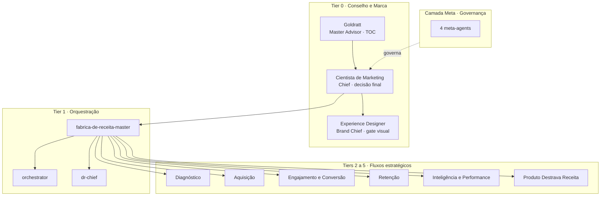

# Arquitetura

Este documento descreve como o Squad Fábrica de Receita está organizado: a hierarquia de comando tier a tier, os 7 fluxos estratégicos, o protocolo de invocação, os Quality Gates, as business rules e as decisões de design que sustentam tudo.

---

## Visão geral

O squad é um sistema de comando em camadas. No topo, uma dupla decide (Master Advisor e Chief). No meio, um sub-orquestrador roteia. Na base, especialistas executam dentro de fluxos estratégicos. Uma camada meta cuida de governança e monitoramento acima de tudo. A fonte da verdade de toda essa estrutura é um único manifesto, `squad.yaml`.

---

## Hierarquia de comando, tier a tier

### Tier 0, Conselho Estratégico e Marca

O topo da cadeia. Aqui se decide, não se executa.

- **Goldratt (Master Advisor).** Clone mental do criador da Teoria das Restrições. Antes de qualquer recomendação do Chief, ele valida: qual é o constraint real que limita o Throughput, como subordinar todo o resto a esse constraint, como elevá-lo, e quando ele mudar, voltar ao passo 1. Aplica os 5 Focusing Steps e o método socrático (pergunta antes de responder).
- **Cientista de Marketing (Chief).** Clone mental do Cientista do Marketing. É a autoridade de decisão final. Opera pela hierarquia de valores (Vantagem Competitiva primeiro, depois Dados, Teste, Margem, Retenção, Sistema, Longo Prazo) e pela equação fundamental Marketing igual a LTV dividido por CAC, com regra de ouro de 3 para 1. Decide qual fluxo ativar.
- **Experience Designer (Brand Chief).** Autoridade visual. Governa identidade, tipografia, acessibilidade WCAG AA e a proibição absoluta de azul. Atua como gate de qualidade criativa: nenhuma peça publicável sai do squad sem passar por ele.

### Tier 1, Orquestração Operacional

Traduz estratégia em execução.

- **fabrica-de-receita-master (Sub-Orchestrator).** Recebe a direção do Chief, aciona os especialistas dos fluxos ativados, agrega os outputs e retorna a síntese.
- **orchestrator.** Faz o routing fino entre especialistas quando a missão cruza mais de um fluxo.
- **dr-chief.** Coordena o específico dos produtos Destrava Receita.

### Tier 2, Diagnóstico Científico

"Sem dados não há diagnóstico." Identifica a trava real antes de qualquer ação.

- **diagnosticador.** Diagnóstico das 8 travas com CRT e Evaporating Cloud.
- **especialista-spiced.** Qualificação pelo framework SPICED.
- **estrategista-receita.** Mapeamento estratégico de receita, ICP e forecast.

### Tier 3, Execução (Aquisição, Engajamento e Conversão, Retenção)

Onde os 4 Pilares viram ação.

- **Aquisição** (Pilar Tráfego): `traffic-hunter`, `fabricante-aquisicao`, `growth-strategist`.
- **Engajamento e Conversão** (Pilares 2 e 3): `conversion-optimizer`, `maquina-comercial`.
- **Retenção** (Pilar LTV): `retention-architect`, `guardiao-retencao`.

### Tier 4, Inteligência e Performance

Mede, otimiza e desenha o sistema. A matemática não mente.

- **roi-analyst.** ROI, unit economics, atribuição.
- **growth-planner.** Planejamento de growth e budget.
- **revenue-team-architect.** Arquitetura do time de receita, eliminação de silos.

### Tier 5, Produtos Destrava Receita e Execução

Operacionaliza os produtos DR com IA no centro.

- **destrava-receita-consultant.** Discovery, qualificação e pitch dos produtos DR.
- **ai-marketing-engineer.** IA aplicada a marketing, automações, MarTech.
- **content-engine.** Engine de conteúdo, copy, email.
- **ops-dr.** Operações dos contratos, boards, kickoff, RACI.

### Camada Meta (F4), Governança e Monitoramento

Quatro meta-agents em um tier acima do Chief, focados no portfólio e na saúde do squad ao longo do tempo, não na missão individual.

- **fdr-portfolio-strategist.** Estratégia de portfólio de receita cross-cliente e alocação de budget.
- **fdr-quality-monitor.** Rastreio de qualidade de receita, saúde de funil e atribuição.
- **fdr-pattern-detector.** Detecção de padrões vencedores e de anti-padrões de funil furado.
- **fdr-knowledge-architect.** Curadoria da base de conhecimento e evolução dos clones.

---

## Os 7 fluxos estratégicos

Abaixo do conselho e da orquestração, os especialistas vivem em fluxos. Cada fluxo mapeia para um pilar ou trava.

| Fluxo | Tier | Pilar | Travas cobertas | Agents |
|-------|:----:|----------|-----------------|--------|
| Diagnóstico | 2 | (transversal) | Cegueira (T1) | diagnosticador, especialista-spiced, estrategista-receita |
| Aquisição | 3 | Tráfego | Exposição (T8), Atenção (T7), Interesse (T6) | traffic-hunter, fabricante-aquisicao, growth-strategist |
| Engajamento e Conversão | 3 | Engajamento, Conversão | Qualificação (T5), Compromisso (T4), Decisão (T3) | conversion-optimizer, maquina-comercial |
| Retenção | 3 | Retenção | Retenção (T2) | retention-architect, guardiao-retencao |
| Inteligência e Performance | 4 | (mensuração) | (todas, via métrica) | roi-analyst, growth-planner, revenue-team-architect |
| Produto Destrava Receita | 5 | (execução) | (todas, via produto) | destrava-receita-consultant, ai-marketing-engineer, content-engine, ops-dr |
| Brand e Design | 0 | (governança visual) | (gate criativo) | experience-designer |

---

## Protocolo de invocação (5 passos)

Toda missão percorre a mesma sequência. Ela é a materialização do protocolo chief-first: o comando entra pelo topo, o Chief planeja, e só então a execução acontece.

1. **Master Advisor (Goldratt).** Aplica a Teoria das Restrições ao problema: identifica o constraint (gargalo de Throughput), decide como explorar e subordinar, e reporta a análise ao Chief.
2. **Chief (Cientista de Marketing).** Aplica o Protocolo de Consultoria de 5 passos (Diagnóstico com 3 perguntas, Provocação Estratégica com analogias, Framework Aplicável, Matemática do Negócio, Próximo Passo Claro) e decide qual fluxo estratégico ativar.
3. **Sub-Orchestrator (fabrica-de-receita-master).** Roteia para os especialistas do fluxo ativado, coordena a execução, agrega os outputs e retorna a síntese.
4. **Specialists.** Executam a task específica seguindo seus templates, skills e data. Reportam ao sub-orquestrador.
5. **Brand Chief (Experience Designer).** Acionado quando o output envolve peça visual ou copy publicável. Aplica o checklist de brand compliance e emite um veredito: aprovado, correções menores ou reprovado. Se reprovado, a peça volta ao especialista com feedback estruturado.

O único desvio permitido é o acesso direto a UM especialista isolado, sem orquestração de squad, para tarefas pontuais. Qualquer coisa que envolva mais de um especialista ou planejamento passa pelo Chief.

---

## Quality Gates

Quatro gates canônicos, no formato F4 estruturado, guardam as fases da missão.

| Gate | Nome | Fase | Bloqueante | O que valida |
|------|------|------|:----------:|--------------|
| QG-001 | Validação de Entrada | diagnóstico | não | Dados mínimos do negócio coletados, ICP identificado, baseline de métricas registrado |
| QG-002 | Diagnóstico Validado | estratégia | sim | Trava confirmada pelo teste 2 de 3, constraint validado pelo Master Advisor, qualificação SPICED completa |
| QG-003 | Completude de Execução | execução | sim | Plano STEP com owners, tasks do ciclo executadas, compliance visual aprovado, automações validadas |
| QG-004 | Qualidade de Saída | monitoramento | não | ROI medido contra baseline, tom de voz verificado, ortografia completa e zero travessão, relatório no template oficial |

---

## Business rules

Sete regras codificam a matemática dura do método. Cada uma se ancora em um Quality Gate.

| Regra | Nome | Ancora em | Bloqueante | Essência |
|-------|------|:---------:|:----------:|----------|
| BR-001 | Regra de ouro da matemática | QG-004 | não | LTV por CAC maior ou igual a 3 para 1 (excelência 5 para 1), payback dentro do ciclo de caixa |
| BR-002 | 1 trava por ciclo | QG-002 | sim | Cada ciclo de 90 dias ataca exatamente 1 trava, trocar exige aprovação do Chief |
| BR-003 | Diagnóstico 2 de 3 | QG-002 | sim | Trava só é confirmada quando 2 dos 3 métodos de diagnóstico convergem |
| BR-004 | Idioma e voz | QG-004 | sim | Acentuação completa, zero travessão, tom de voz canônico em todos os agentes |
| BR-005 | Brand compliance | QG-003 | sim | Paleta do brandbook, logo oficial nunca recriado, contraste WCAG AA validado |
| BR-006 | Zero preço no repositório | QG-004 | sim | Nenhum valor monetário de produto, investimento sob consulta comercial |
| BR-007 | Benchmarks de funil como referência | QG-001 | não | Todo diagnóstico compara métricas atuais com os benchmarks canônicos da base de conhecimento |

---

## Decisão de design: manifesto único como fonte da verdade

O squad tem exatamente **uma** fonte da verdade: o arquivo `squad.yaml`. Ele declara a hierarquia (master_advisor, chief, sub_orchestrator, brand_chief), os fluxos estratégicos, os Quality Gates, as business rules, os tiers, a filosofia, o protocolo de invocação e o bloco `components`, que lista cada arquivo físico de agent, task, workflow, skill, template, checklist e data.

Por que um manifesto único:

- **Sem divergência.** Não existe uma segunda lista que possa ficar dessincronizada. A validação (`scripts/validate-squad.sh`) confere que cada componente listado no manifesto existe no disco e vice-versa.
- **Um lugar para auditar.** Quem quer entender o squad lê um arquivo, não caça a verdade em vários pontos.
- **Command e agents amarrados ao manifesto.** O comando `/fdr-` carrega o manifesto, faz health check dos agents declarados, adota a persona do Chief (arquivo canônico em `agents/`) e delega. O comando não reimplementa a hierarquia, ele a lê.

### Como command e agents se relacionam

O comando `/fdr-` é fino de propósito. Ele não sabe estratégia de receita: ele sabe carregar o manifesto e entrar pelo Chief. Toda a inteligência vive nos arquivos de persona em `agents/`. O comando faz 4 coisas:

1. Carrega o manifesto `squad.yaml`.
2. Valida no filesystem os agents declarados em `components.agents`.
3. Adota a persona do Chief (`agents/cientista-de-marketing.md`), o entry agent canônico.
4. A partir daí, o Chief planeja e delega, seguindo o protocolo de invocação de 5 passos.

Assim, editar a inteligência do squad significa editar os arquivos de persona e o manifesto, nunca o comando. O comando permanece estável enquanto método evolui.
